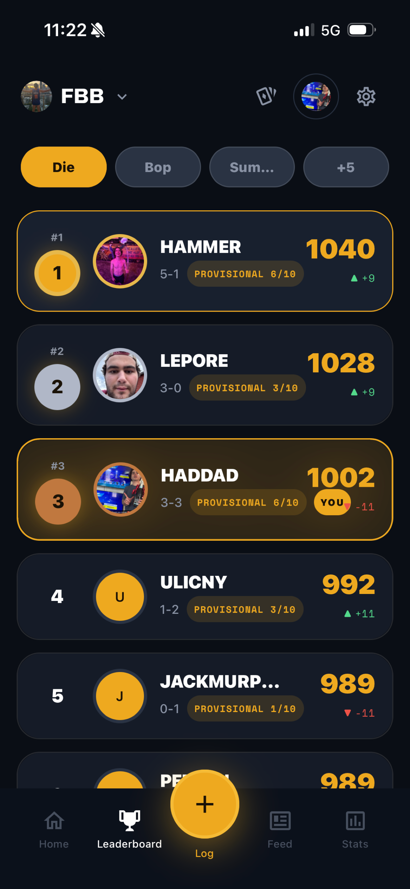

# BeerLo.net — marketing site

The static website for BeerLo, ready to deploy to **Cloudflare Pages** via **GitHub**.

It's two HTML pages, one stylesheet, and a folder of images — no build step, no framework, no server.

## What's in here

```
beerlo-site/
├── index.html          ← home page (hero, features, screens, FAQ, CTA, footer)
├── support.html        ← Apple-required support page (FAQ, account deletion, privacy, terms)
├── styles.css          ← all visual styling (3 themes baked in)
├── images/
│   ├── app-icon.png            ← BeerLo logo mark, used in nav + footer
│   ├── app-icon-square.png     ← square iOS-style icon, used for apple-touch-icon
│   ├── favicon.png             ← browser tab icon
│   ├── app-logo.png            ← horizontal logo (extra)
│   └── logo-mark.png           ← logo mark only, transparent (extra)
│   └── screenshots/            ← drop your iPhone screenshots here (see below)
├── tweaks-panel.jsx    ← preview-only design tool — IGNORE, won't load on the live site
├── tweaks-app.jsx      ← preview-only design tool — IGNORE, won't load on the live site
└── README.md           ← this file
```

The two `tweaks-*.jsx` files only load inside the Claude design preview (they let me swap themes/layouts live). They cost nothing on the deployed site — the loader is gated on `window.parent !== window`, so a real visitor never downloads React.

---

## Adding your screenshots

Right now the site shows six "placeholder" phone mockups. To replace them with real screenshots:

1. Take screenshots inside the app on an iPhone — Leaderboard, Log Game, Tournament, Stats, Game Feed, Group screens are the six slots.
2. Save them as PNGs in `images/screenshots/`. Suggested names: `leaderboard.png`, `log.png`, `tournament.png`, `stats.png`, `feed.png`, `group.png`.
3. In `index.html`, find each `<div class="phone-mockup">` and replace the inner content:

   **Before:**
   ```html
   <div class="phone-mockup" aria-label="Leaderboard screen placeholder">
     <div class="notch"></div>
     <div class="phone-screen"><div class="placeholder-label">Leaderboard</div></div>
   </div>
   ```

   **After:**
   ```html
   <div class="phone-mockup" aria-label="Leaderboard">
     <div class="notch"></div>
     
   </div>
   ```

   The `img` will fill the phone frame automatically — the CSS handles the rounded corners.

---

## Step-by-step: get this live on beerlo.net

### 1. Buy the domain
- Make a [Cloudflare](https://cloudflare.com) account.
- Go to **Domain Registration → Register Domain** and buy `beerlo.net`. Cloudflare sells at cost; no renewal price hikes.

### 2. Put the code on GitHub
- Make a free [GitHub](https://github.com) account.
- Click **New repository** → name it `beerlo-site` → make it **Public** (Cloudflare Pages can read private repos too, but public is simpler) → Create.
- Click **uploading an existing file** and drag in everything from this folder (or use the GitHub Desktop app if you prefer).
- Commit the upload.

### 3. Connect Cloudflare Pages to GitHub
- In Cloudflare dashboard, go to **Workers & Pages → Create → Pages → Connect to Git**.
- Authorize Cloudflare to read your GitHub.
- Select the `beerlo-site` repo.
- Build settings:
  - **Framework preset:** None
  - **Build command:** *(leave blank)*
  - **Build output directory:** `/` *(or leave blank)*
- Click **Save and Deploy**.
- In about 30 seconds your site is live at `beerlo-site.pages.dev`.

### 4. Point beerlo.net at the site
- Inside the Pages project, go to **Custom domains → Set up a custom domain**.
- Enter `beerlo.net` → Continue. Cloudflare auto-creates the DNS record because you bought the domain through them.
- Repeat for `www.beerlo.net` if you want both.
- HTTPS is automatic. You're done.

### 5. (Optional) Set up the support email
- In Cloudflare dashboard, pick `beerlo.net` → **Email → Email Routing**.
- Add a custom address: `beerlo346@beerlo.net` (or `support@beerlo.net`, your choice) → forward to your real Gmail.
- Verify the forwarding address in Gmail.
- If you change the public address, update the two `mailto:beerlo346@gmail.com` and "Email us" lines in `support.html` and `index.html` to match.

---

## Updating the site later

**Pushing to GitHub does NOT deploy the site.** This project is a Cloudflare
*Worker* serving static assets, and it is deployed manually with the Wrangler
CLI. GitHub is version control only.

To publish changes:

```bash
cd ~/Downloads/"BeerLo website"

git add -A
git commit -m "describe the change"
git push origin main     # version control

npx wrangler deploy      # <- this is what actually makes it live
```

The first `wrangler` run opens a browser to log in to Cloudflare. After that
it remembers you.

Deploy settings live in `wrangler.jsonc`; `.assetsignore` lists files that
should stay out of the public site (README, the tweaks-*.jsx preview tools, etc).

### Want push-to-deploy instead?
In the Cloudflare dashboard: **Workers & Pages → beerlo-site → Settings → Build**,
connect the GitHub repo and set the branch to `main`. Once connected, pushes
build automatically and `npx wrangler deploy` is no longer needed.

---

## Things you'll likely want to edit

- **App Store link** — search for `apps.apple.com/app/beerlo` and replace with your real App Store URL (appears in 3 places: nav, hero CTA, CTA band, footer).
- **Support email** — search for `beerlo346@gmail.com` and replace (appears in `index.html` footer and `support.html` in multiple spots).
- **Tagline / hero copy** — `index.html`, look for `<h1 class="hero-title">` and `<p class="hero-lead lead">`.
- **Color theme** — open `styles.css` and tweak the `:root` variables, or pick a different default theme by changing `data-theme="dark"` on the `<html>` tag in both HTML files to `"cream"` or `"amber"`.

---

Brewed with caffeine and questionable rim shots.
